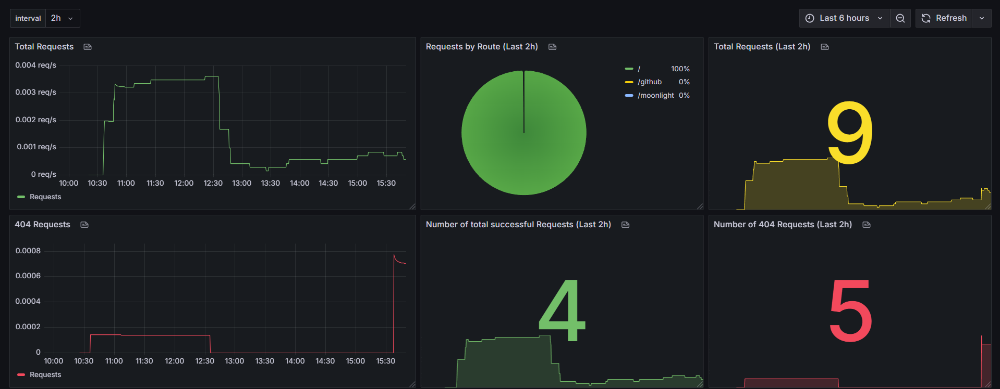

# Linkrouter
**LinkRouter** is a lightweight, configurable routing application that directs incoming requests to designated target URLs based on a user-defined configuration file.

[⬇️How to install⬇️](#installation)

## Features
 -   **Path-based Redirection:** Reads a config file that maps paths to redirect URLs. When a request hits a registered path, the router issues an HTTP redirect to the corresponding target.
-   **Hot Reloading:** The config is cached at startup and automatically reloaded when the file changes — no restart required. [Example config](#example-config)
-   **Low Resource Usage:** Uses less than 50MB of RAM, making it ideal for constrained environments. 
-   **Metrics Endpoint:** Exposes Prometheus-compatible metrics at `:5000/metrics` for easy observability and monitoring. [How to use](#metrics)
 -   **Docker-Deployable:** Comes with a minimal Dockerfile for easy containerized deployment.

## Configuration
Routes are managed via a configuration file, `/data/config.json`. You can define paths and their corresponding URLs in this file. The application automatically normalizes routes to handle both trailing and non-trailing slashes.
> Every route **must** start with a slash
### Example Config
```json
{
  "RootRoute": "https://example.com", // route on the root on the app (eg: yourdomain.com)
  "NotFoundBehavior": { // the behavior when the requested path was not found in the routes below
    "RedirectOn404": false, // if it should redirect on 404
    "RedirectUrl": "https://example.com/404" // where it should redirect to
  },
  "Routes": [
    {
      "Route": "/instagram", // has to start with a slash
      "RedirectUrl": "https://instagram.com/{yourname}"
    },
    {
      "Route": "/example", // has to start with a slash
      "RedirectUrl": "https://example.com"
    }
  ]
}
```
## Installation
> **Docker** is required to deploy this project. [Install docker](https://docs.docker.com/get-started/)

### Using Docker Compose
1. Create a `docker-compose.yml` file with the following content:

```yaml
services:
  linkrouter:
    image: ghcr.io/mxritzdev/linkrouter:latest
    ports:
      - "80:8080"
    volumes:
      - ./data:/app/data
```
2. Run `docker compose up -d` to start the container
3. Configure your routes in `./data/config.json`
### Using `docker run`
1. Run this command: `docker run -p 80:8080 -v ./data:/app/data ghcr.io/mxritzdev/linkrouter:latest`
2. Configure your routes in `./data/config.json`

## Metrics
Prometheus-compatible metrics are exposed on `:5000/metrics`

> ‼️**Do not expose port `5000` to the public internet, instead use internal [docker networking](https://docs.docker.com/engine/network/)**

### Available Metrics

The following metrics are currently exported:

-   `linkrouter_requests{route="..."}` — Counter of total redirects served, labeled by route.
    
-   `linkrouter_404_requests{route="..."}` — Counter of requests that resulted in a 404 Not Found, labeled by the originally requested route.

    
Metrics follow the Prometheus exposition format, and can be scraped directly by Prometheus or queried via tools like Grafana. [Example Grafana Dashboard](.ressources/example-grafana-dashboard.json)



### Example Prometheus Scrape Config
```yaml
scrape_configs:
  -  job_name:  'linkrouter'
    static_configs:
    -  targets: ['{linkrouter host}:5000']
```
## Contributing

Contributions are welcome! Please submit a pull request or open an issue to discuss improvements or new features.

## License

This project is licensed under the MIT License - see the [LICENSE](LICENSE) file for details.

##  Contact

For questions or support, please reach out via discord at **mxritzdev**
